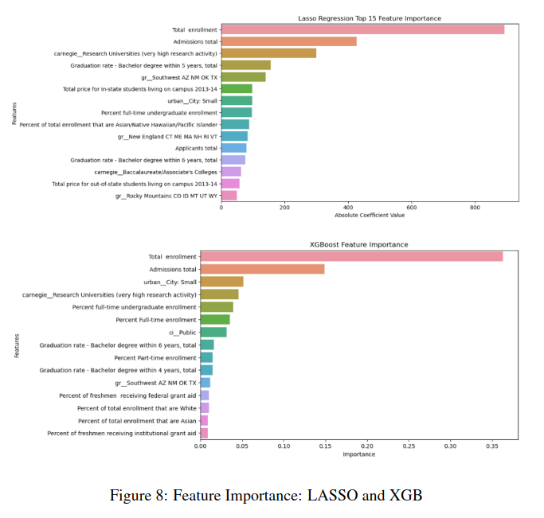

# College Enrollment Prediction Project
#### Robert Conner 
 https://www.linkedin.com/in/robert-conner8/

 https://www.RobertjConner.com/

## Description
The College Enrollment Prediction Project aims to assist universities in accurately forecasting student enrollments, facilitating better resource allocation and strategic planning. Leveraging machine learning algorithms, the project analyzes institutional data from colleges across the United States to uncover patterns and insights that influence enrollment numbers. By understanding these factors, universities can make informed decisions to optimize their admissions strategies. This was a challenging dataset that held numerous datapoints of missing information and required some feature engineering.

)

## Features
- Utilizes advanced machine learning algorithms including LASSO/Ridge Regression, Random Forest, Gradient Boosting, and Feed Forward Neural Network.
- Comprehensive data preprocessing techniques such as one-hot encoding, imputation of missing data, and feature engineering.
- Optuna hyperparameter tuning for model optimization.
- Evaluation metrics include Mean Squared Error (MSE), Mean Absolute Error (MAE), and R² to assess predictive performance.
- Insights into influential factors such as total enrollment, Carnegie Classification, and geographical location.

## How It Works
- Data Collection: Gather institutional data from colleges across the United States.
- Preprocessing: Clean and prepare the data, including one-hot encoding, imputation of missing values, and feature engineering.
- Model Training: Utilize machine learning algorithms to train predictive models on the preprocessed data.
- Hyperparameter Tuning: Optimize model hyperparameters using Optuna to improve predictive accuracy.
- Model Evaluation: Assess model performance using evaluation metrics such as MSE, MAE, and R².
- Insights Generation: Analyze feature importance to understand the key factors influencing enrollment predictions.

## Getting Started
To get started with the College Enrollment Prediction Project, follow these steps:

- Clone the project repository from GitHub.
- Install the required dependencies using pip or conda.
- Run the provided Jupyter Notebook or Python scripts to explore the data, train models, and generate predictions.
- Experiment with different algorithms and hyperparameters to optimize predictive performance.

## Technical Details
- Technologies Used: Python, Jupyter Notebook, scikit-learn, Optuna.
- Data Preprocessing: One-hot encoding, imputation of missing data, feature engineering.
- Machine Learning Algorithms: LASSO/Ridge Regression, Random Forest, Gradient Boosting, Feed Forward Neural Network.
- Hyperparameter Tuning: Optuna for optimizing model hyperparameters.
- Evaluation Metrics: Mean Squared Error (MSE), Mean Absolute Error (MAE), R².

## Other Use Cases
- Enrollment forecasting for individual departments or programs within universities.
- Predictive modeling for student retention and graduation rates.
- Application in educational policy-making for resource allocation and program development.
